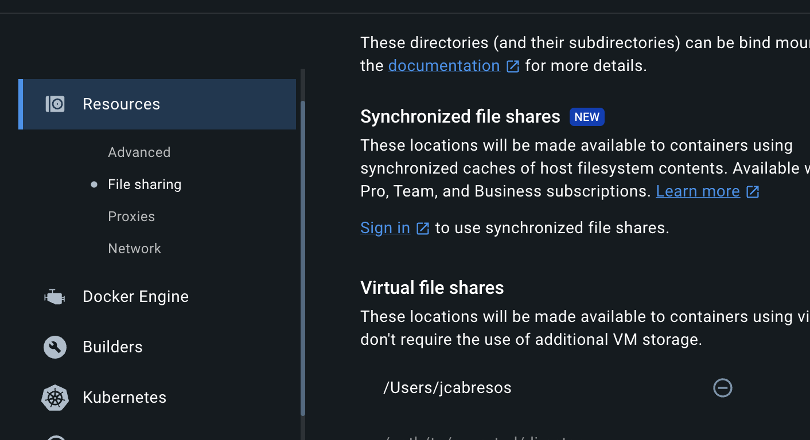

# 😥 Troubleshooting

## JFrog

### `lock hasn't been acquired`

If you encounter timeout (freezing) during JFrog authentication and then a timeout error message "[Error] lock hasn't been acquired", please update JFrog CLI to the latest version

---

### `outdated jfrog cli extension`

If you get "outdated jfrog cli extension" during Jfrog authentication, check the node version you are using. Known working versions (as of January 2024) are 18.19. and 20.6.1., known not working versions are 18.16.
This can be subject to change. You can use nvm to change your node version easily, to install see [here](https://github.com/nvm-sh/nvm?tab=readme-ov-file#installing-and-updating)

When installed, use this command to change the

```bash
nvm use <NODE_VERSION>
```

---

## GitHub

### `No such file or directory`

If you get "No such file or directory ".../hosts.yml" (system specific GitHub path) when running commands for templates, it can happen if you did not log in to needed infrastructure using command

```bash
pulse8 auth login
```

---

### `Token invalid`

If you see the text

```text
The value of the GITHUB_TOKEN environment variable is being used for authentication.
To have GitHub CLI store credentials instead, first clear the value from the environment.
```

during the environment login steps, use

```bash
unset GITHUB_TOKEN
```

to remove the currently set token. After that you can restart the environment login process and you should be prompted to authenticate. This in turn should set the correct token.

---

## Docker / K3D

### Failed cluster start `/<something>` is not a shared mount

**Note that this issue has only been encountered by Docker Desktop users. Please consider migrating to [Colima or other alternatives as described here](https://synpulse.atlassian.net/wiki/spaces/SYN8/pages/3296067599/Using+Docker+CLI+over+Docker+Desktop).**

Full error message may look something like this:

```bash
Failed Cluster Start: Failed to start server k3d-local-dev-server-0: runtime failed to start node 'k3d-local-dev-server-0': docker failed to
start container for node 'k3d-local-dev-server-0': Error response from daemon: path /host_mnt/Users/user/.pulse8/volumes/local-dev/var/lib/kubelet/pods is
mounted on /host_mnt but it is not a shared mount
```

To fix this:

1. Update your Docker engine to the latest version
2. (If using Docker Desktop) Add your user folder to the virtual fileshare. Example here for user `jcabresos`:
    

---

## Misc

### Firefox `SEC_ERROR_UNKNOWN_ISSUER`

[https://github.com/FiloSottile/mkcert/issues/370](https://github.com/FiloSottile/mkcert/issues/370#issuecomment-1280377305)<https://github.com/FiloSottile/mkcert/issues/370#issuecomment-1280377305>

### `command not found: pulse8`

The logs state messages like these:

```
WARNING: The scripts p8 and pulse8 are installed in '<somepath>' which is not on PATH.
Consider adding this directory to PATH or, if you prefer to suppress this warning, use --no-warn-script-location
```

Just add the `<somepath>` from the message to your PATH.  

---
